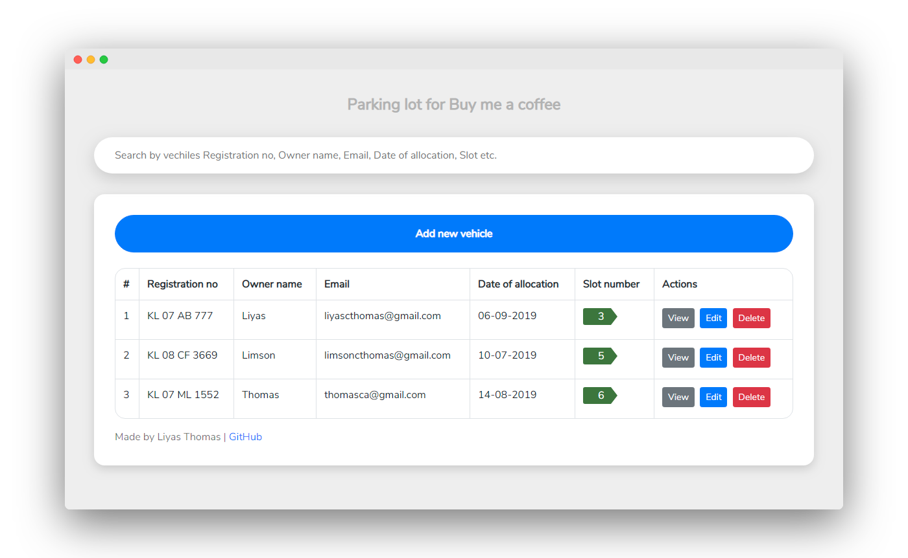

# parkinglot for buy me a coffee

## Demo

https://liyasthomas.github.io/parkinglot

## System Requirements

I will focus on the following set of requirements while designing the parking lot:

- The parking lot have multiple slots. Slots are filled in FCFS (First-Come-First-Serve) order.

- Customers can register for parking ticket by providing informations such as vehicle's registration number, owner's name, email ID, date of allocation, slot number etc.

- Once a slot has been occupied by a customer for a particular date, it won't be available for allocation by other customers for the same date. Only one vehicle can be parked in a particular slot on a date.

- Customers can view, edit and delete allocation.

- Deleting a vehicle will deallocate the particular slot for that date.

- Search vehicles by registration number, owner's name, email ID, date of allocation, slot number etc.

- Web UI

## Technology Stack

Languages and libraries used in this project:

- Languages:
 - JavaScript ES6
 - HTML 5
 - CSS 3

- Libraries
 - BootStrap v4.3.1
 - jQuery v3.4.1

## Screenshots

  
  
  
  
  

